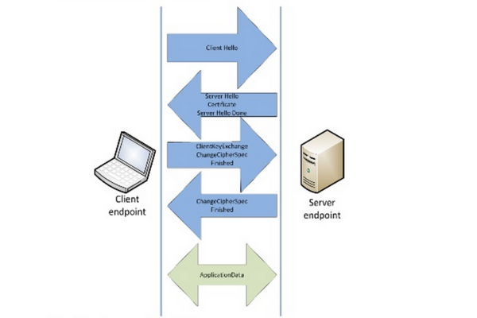

### SSL/TLS协议简介
#### SSL
Secure Socket Layer（安全套结层）
在网景公司的NetScape浏览器推出之初就提出了（SSL安全套接层）
**SSL的功能**
1.加密
SSL作为一种安全协议，它在传输层提供对网络连接加密的功能。
SSL不同于将内容加密,而是将整个的通信线路加密的处理.
2.证书
证书由值得信任的第三方机构颁发,用以证明服务器和客户端是实际存在的.
3.摘要

#### TLS
Transport Layer Security（传输安全层）
**SSL与TLS之间的关系**
最初的SSL应用在web上，被服务器端和浏览器端同时支持，随后IETF将其标准化，成为TLS(传输安全层)

##### 

#### 密钥
对于这个不封的内容大致都能理解

##### 共享密钥加密
1.定义
加密和解密同用一个密钥的方式,称为共享密钥加密,也被叫做
哦对称密钥加密.
2.密钥发送问题
发送密钥就有被窃听的风险,但不发送,对方就不能解密.再说,若密钥能安全到达,那数据也应该能安全到达.

##### 公开密钥加密
1.定义
公开密钥加密使用一对非对称的密钥,一把叫做`私有密钥`,另一把叫做`公有秘钥`.顾名思义,`私有秘钥`不能让其他任何人知道,`公有秘钥`可以随意分发,任何人都可以获得.
2.加密和解密过程
`发送密文的一方`使用对方的`公有秘钥`进行`加密`.`接收密文的一方`收到被加密的信息后,再使用自己的`私有秘钥`进行`解密`.
3.共享秘钥加密和公开秘钥加密这两种方式的比较
公开密钥的加密方式比共享密钥加密的处理速度要慢.
公开密钥的加密方式比共享密钥加密更加的安全.
4.公开密钥加密中存在的问题
无法证明公开密钥本身就是货真价实的公开密钥.比如,正准备和某台服务器建立公开密钥加密方式下的通信,如何证明收到的公开密钥就是原本预想的那台服务器
发行的公开密钥,或许在公开密钥传输途中,真正的公开密钥已经被攻击者替换掉了.

##### https的加密方式
https使用共享秘钥加密和公开秘钥加密这两种方式的混合.

#### 数字证书
**为什么要引用证书**
客户端与服务器端通信的时候，可能会遇到`中间人攻击`，这个时候我们需要对于身份进行验证。

**认证机构的公开秘钥如何安全的转交给客户端**
通过通信的方式,安全转交是一个很困难的事情,因此很多的浏览器厂商发布版本的时候,会事先在内部植入常用认证机关的公开密钥.

**CA**
CA(Certification Authority 数字证书认证中心)
CA机构颁发证书的流程
第一步：服务器通过自己的`私钥`生成CSR（证书签名请求）文件
第二步：ca机构依据这个csf文件颁发服务器端的签名证书

**客户端和服务器端做的不同工作**
服务器:服务器会将由数字证书认证机构颁发的公开密钥发送给客户端
客户端:使用数字证书认证机构的公开密钥,对那张证书上的数字签名进行验证.

**认证机构的公开密钥如何安全的转交给客户端**
若使用通信的方式,如何安全转交是一件很困难的事,因此,多数的浏览器开发商发布版本的时候,会事先在内部植入常用认证机构的公开密钥.

### 握手流程
1.客户端对HTTPS的地址发出请求，并且将自己的SSL版本号等信息发送给服务器
2.服务器接收到请求，将服务器证书和公钥等信息返回给客户端
3.客户端接收到证书后向证书颁发机构验证证书的合法性。如果证书不合法（比如自行签发的证书），则向用户发出警告并确认是否继续，用户可以选择在此时离开终止HTTPS的链接。
4.证书合法或客户端确认在不安全的情况下继续，客户端生成pre-master secret并且使用2中收到的服务器公钥加密后发送给服务器。如果是使用交互策略的TLS，则同时需要将客户端的证书发送给服务器。服务器检查客户端的证书颁发机构是否在信任列表中，以及证书内容是否合法。若不合法，结束本次会话。
5.服务器使用私钥解密pre-master secret，然后双方通过一种实现商定好的加密算法生成本次通讯使用的master secret。
6.双方互相通知对方本次SSL握手成功，其后均使用master secret对传输内容进行加密。

### 下载安装open ssl

## API
### `Class: tls.TLSSocket`
`net.Socket`实例对象的包装器,对于流入或者流出的数据进行加密或者解密的操作。
### `Class: SecurePair`
tls.createSecurePair 返回一个SecurePair类
### `Class: tls.Server`
这个类是`net.Server`的一个子类，它和`net.Server`具有同样的方法。
### `Class: CryptoStream`
### `Class: tls.TLSSocket`

参考文献：
http://nodejs.cn/api/tls.html
http://segmentfault.com/a/1190000002630688
《深入浅出node》
<图解HTTP>