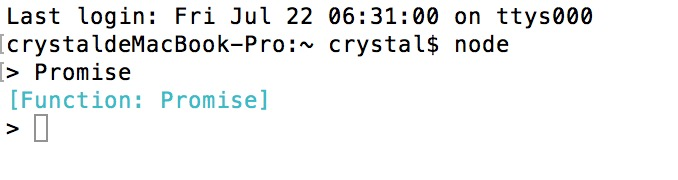

### 问题
1.为什么需要异步编程?比如promise
   在JS中如果需要等待某个操作完成之后,再做某个操作的话,很多的时候用的是回调函数来完成.如果回调函数过多的话,容易形成cal back hell.
   这个时候就会遇到问题了,因此说需要我们做进一步的操作
   
2.学习Promise需要了解的内容
   -es6的Promise语言标准,Promise/A 规范
   -如何使用
   -在什么场景下使用
   
学习ES6的新特性的时候,需要想要个问题,这个新特性是针对什么场景的解决方案.因此ES6的新特性并不是平白无故的产生的,它是开发者为了解决特定的问题而产生的
一种解决方案.因此说有必要了解它是针对什么场景.比如.promise是为了解决异步问题而出现的一种解决方案.

3.异步场景常用的解决方式
 -回调
 -事件机制
 
4.Promise对象的3中状态
 -未完成(pending)
 -已完成(fulfilled)
 -失败(rejected)
 
 ### 对于之前写的慕课网的爬虫工具进行promise化
 1.查看node对于promise的支持?
 
 
 